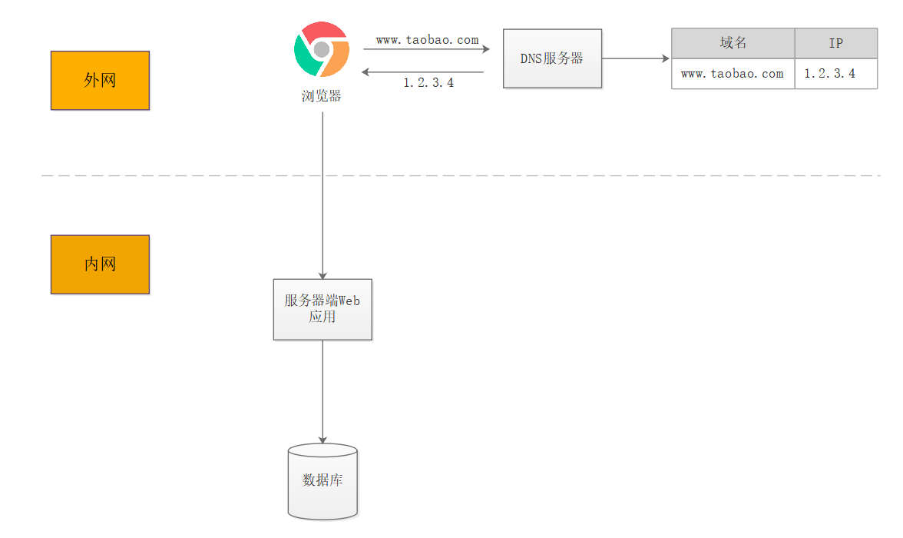

# 高并发架构演进
## 初始架构：单体应用，应用与数据库分开部署

1. 架构描述
   * 基于freemarker模板引擎的单体应用
   * 浏览器往www.taobao.com发起请求时，经过DNS服务器把域名转换为实际IP地址，浏览器转而访问该IP对应的前端Tomcat服务器。
   * Tomcat和数据库分别独占服务器资源，显著提高两者各自性能。
2. 瓶颈点
   * 并发读写数据库成为瓶颈
## 第一次演进：引入本地缓存和分布式缓存
1. 架构描述
  * 在Tomcat同服务器上或同JVM中增加本地缓存
  * 外部增加分布式缓存，缓存热门商品信息或热门商品的html页面等。涉及缓存一致性、缓存穿透/击穿、缓存雪崩、热点数据集中失效等问题。
  * 通过缓存能把绝大多数请求在读写数据库前拦截掉，大大降低数据库压力。
  * 如果缓存扛不住，还可以采用消息队列，如：金融场景RocketMQ，高吞吐量的kafka

2. 瓶颈点
   * 缓存抗住了大部分的访问请求，随着用户数的增长，并发压力主要落在单机的Tomcat上，响应逐渐变慢
## 第二次演进：引入反向代理实现负载均衡，动静分离
1. 架构描述
   * 在多台服务器上分别部署Tomcat，使用反向代理软件（Nginx）把请求均匀分发到每个Tomcat中。假设Tomcat最多支持100个并发，Nginx最多支持50000个并发，那么理论上Nginx把请求分发到500个Tomcat上，就能抗住50000个并发。
   * 网络第七层的反向代理软件，主要支持http协议，还会涉及session共享、文件上传下载的问题。
   * 静态资源可放到Nginx服务器，不必访问Tomcat服务器，也可引入CDN，提升静态文件的加载速度
2. 瓶颈点
   * 反向代理使应用服务器可支持的并发量大大增加，但并发量的增长也意味着更多请求穿透到数据库，单机的数据库最终成为瓶颈
## 第三次演进：数据库读写分离
1. 架构描述
   * 把数据库划分为读库和写库，读库可以有多个，通过同步机制把写库的数据同步到读库。
   * 对于需要查询最新写入数据场景，可通过在缓存中多写一份，通过缓存获得最新数据。
   * 其中涉及数据库中间件，可通过它来组织数据库的分离读写和分库分表，客户端通过它来访问下层数据库
   * 还会涉及数据同步，数据一致性的问题。
2. 瓶颈点
   * 业务逐渐变多，不同业务之间的访问量差距较大，不同业务直接竞争数据库，相互影响性能
## 第四次演进：数据库按业务分库
1. 架构描述
   * 把不同业务的数据保存到不同的数据库中，使业务之间的资源竞争降低，对于访问量大的业务，可以部署更多的服务器来支撑。
   * 这样同时导致跨业务的表无法直接做关联分析，需要通过其他途径来解决，但这不是本文讨论的重点，可以自行搜索解决方案。
2. 瓶颈点
   * 随着用户数的增长，单机的写库会逐渐会达到性能瓶颈
## 第五次演进：把大表拆分为小表
1. 架构描述
   * 比如针对评论数据，可按照商品ID进行hash，路由到对应的表中存储；
   * 针对支付记录，可按照小时创建表，每个小时表继续拆分为小表，使用用户ID或记录编号来路由数据。只要实时操作的表数据量足够小，请求能够足够均匀的分发到多台服务器上的小表，那数据库就能通过水平扩展的方式来提高性能。
   * 其中前面提到的Mycat也支持在大表拆分为小表情况下的访问控制。
   * 这种做法显著的增加了数据库运维的难度，对DBA的要求较高。
2. 瓶颈点
   * 数据库和Tomcat都能够水平扩展，可支撑的并发大幅提高，随着用户数的增长，最终单机的Nginx会成为瓶颈
## 第六次演进：使用LVS或F5来使多个Nginx负载均衡
1. 架构描述
   * 由于瓶颈在Nginx，因此无法通过两层的Nginx来实现多个Nginx的负载均衡。图中的LVS和F5是工作在网络第四层的负载均衡解决方案，其中LVS是软件，运行在操作系统内核态，可对TCP请求或更高层级的网络协议进行转发，因此支持的协议更丰富，并且性能也远高于Nginx。
   * 可假设单机的LVS可支持几十万个并发的请求转发；由于LVS是单机版的软件，因此需要有备用节点。
   * 可使用keepalived软件模拟出虚拟IP，然后把虚拟IP绑定到多台LVS服务器上
2. 瓶颈点
   * 由于LVS也是单机的，随着并发数增长到几十万时，LVS服务器最终会达到瓶颈，此时用户数达到千万甚至上亿级别，用户分布在不同的地区，与服务器机房距离不同，导致了访问的延迟会明显不同
## 第七次演进：通过DNS轮询实现机房间的负载均衡
1. 架构描述
   * 在DNS服务器中可配置一个域名对应多个IP地址，每个IP地址对应到不同的机房里的虚拟IP。当用户访问www.taobao.com时，DNS服务器会使用轮询策略或其他策略，来选择某个IP供用户访问。此方式能实现机房间的负载均衡。
   * 至此，系统可做到机房级别的水平扩展，千万级到亿级的并发量都可通过增加机房来解决，系统入口处的请求并发量不再是问题。
2. 瓶颈点
   * 随着数据的丰富程度和业务的发展，检索、分析等需求越来越丰富，单单依靠数据库无法解决如此丰富的需求
## 第八次演进：引入NoSQL数据库和搜索引擎等技术
1. 架构描述
   * 当数据库中的数据多到一定规模时，数据库就不适用于复杂的查询了，而且在跑复杂查询时会导致其他查询变慢。
   * 对于全文检索、可变数据结构等场景，数据库天生不适用。因此需要引入合适的解决方案。
   * 如对于海量文件存储，可通过分布式文件系统HDFS解决，对于key value类型的数据，可通过HBase和Redis等方案解决，对于全文检索场景，可通过搜索引擎如ElasticSearch解决，对于多维分析场景，可通过Kylin或Druid等方案解决。
2. 瓶颈点
   * 引入更多组件解决了丰富的需求，业务维度能够极大扩充，随之而来的是一个应用中包含了太多的业务代码，业务的升级迭代变得困难
## 第九次演进：大应用拆分为小应用
1. 架构描述
   * 按照业务板块来划分应用代码，使单个应用的职责更清晰，相互之间可以做到独立升级迭代。这时候应用之间可能会涉及到一些公共配置，可以通过分布式配置中心Zookeeper来解决。
2. 瓶颈点
   * 不同应用之间存在共用的模块，由应用单独管理会导致相同代码存在多份，导致公共功能升级时全部应用代码都要跟着升级
## 第十次演进：复用的功能抽离成微服务(dubbo+springcloud)
1. 架构描述
   * 如用户管理、订单、支付、鉴权等功能在多个应用中都存在，那么可以把这些功能的代码单独抽取出来形成一个单独的服务来管理，这样的服务就是所谓的微服务。
   * 应用和服务之间通过HTTP、TCP或RPC请求等多种方式来访问公共服务，每个单独的服务都可以由单独的团队来管理。此外，可以通过Dubbo、SpringCloud等框架实现服务治理、限流、熔断、降级等功能，提高服务的稳定性和可用性。
2. 瓶颈点
   * 业务不断发展，应用和服务都会不断变多，应用和服务的部署变得复杂，同一台服务器上部署多个服务还要解决运行环境冲突的问题，此外，对于如大促这类需要动态扩缩容的场景，需要水平扩展服务的性能，就需要在新增的服务上准备运行环境，部署服务等，运维将变得十分困难
## 第十一次演进：mesh（istio）+k8s
1. 架构描述
   * 应用/服务可以打包为Docker镜像，通过K8S来动态分发和部署镜像。Docker镜像可理解为一个能运行你的应用/服务的最小的操作系统，里面放着应用/服务的运行代码，运行环境根据实际的需要设置好。把整个“操作系统”打包为一个镜像后，就可以分发到需要部署相关服务的机器上，直接启动Docker镜像就可以把服务起起来，使服务的部署和运维变得简单
2. 瓶颈点
   * 不同服务的接口访问方式不同，应用代码需要适配多种访问方式才能使用服务，此外，应用访问服务，服务之间也可能相互访问，调用链将会变得非常复杂，逻辑变得混乱
## 第十二次演进：引入企业服务总线ESB屏蔽服务接口的访问差异
1. 架构描述
   * 通过ESB统一进行访问协议转换，应用统一通过ESB来访问后端服务，服务与服务之间也通过ESB来相互调用，以此降低系统的耦合程度。这种单个应用拆分为多个应用，公共服务单独抽取出来来管理，并使用企业消息总线来解除服务之间耦合问题的架构，就是所谓的SOA（面向服务）架构
2. 瓶颈点
## 第十三次演进：支持H5单页应用
1. 架构描述
   * VUE单页应用，前后端分离。VUE通过反向代理、网关，直接访问后端微服务
2. 瓶颈点
   * 前端页面与后端耦合度高，后端需要为前端页面的变化而修改接口
## 第十四次演进：增加BFF层
1. 架构描述
   * 增加BFF层，将前后端解耦，后端微服务专注提供Restful的接口，BFF层负责聚合、裁剪。
   * GraphQL？
2. 瓶颈点

